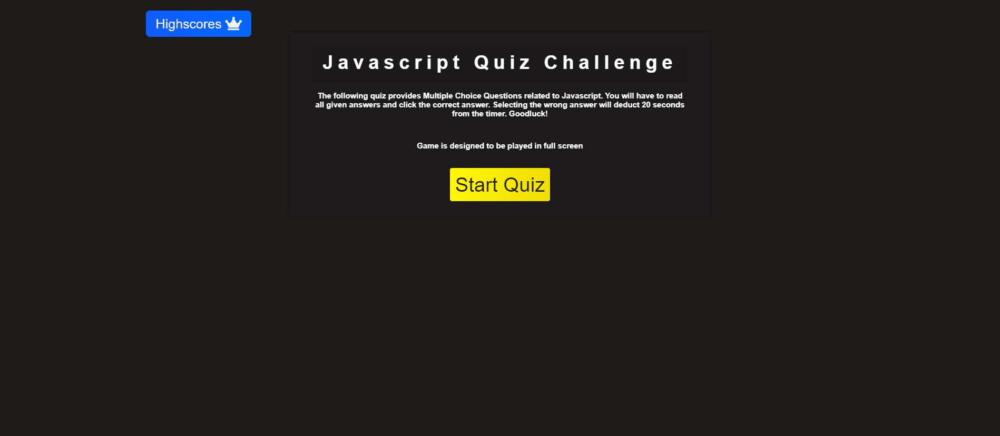

# Class-Quiz
## Multiple choice quiz 
Multiple choice quiz with questions based off of Javascript.

### What was your motivation?
- I wanted to put the skills I have learned to the test and build a project with javascript.

### Why did you build this project?
- Quizes are interactive and a great way to test your knowledge.

### What did you learn?
- How to use localstorage
- Using querySelectors
- Create HTML elements within Javascript
- Create CSS elements within Javascript
- How to use eventListeners

## Sample Website
[DEMO LINK](https://bdubz93.github.io/Class-Quiz/) 
## Installation
- Click the green code button on GitHub
- Select clone, GitHub Desktop, or download ZIP
- Open downloaded folder and open index.html
## Usage
- A fun quiz to check your knowledge of javascript.

## Credits
- https://www.youtube.com/watch?v=f4fB9Xg2JEY
- https://www.youtube.com/watch?v=bGQ9sIHZdlo
- https://www.w3schools.com/jsref/dom_obj_event.asp
- https://www.javascripttutorial.net/javascript-dom/javascript-queryselector/#:~:text=The%20querySelector()%20is%20a,one%20or%20more%20CSS%20selectors.&text=In%20this%20syntax%2C%20the%20selector,descendant%20elements%20of%20the%20parentNode%20

## License
- [APACHE 2.0 LICENSE](license)
---